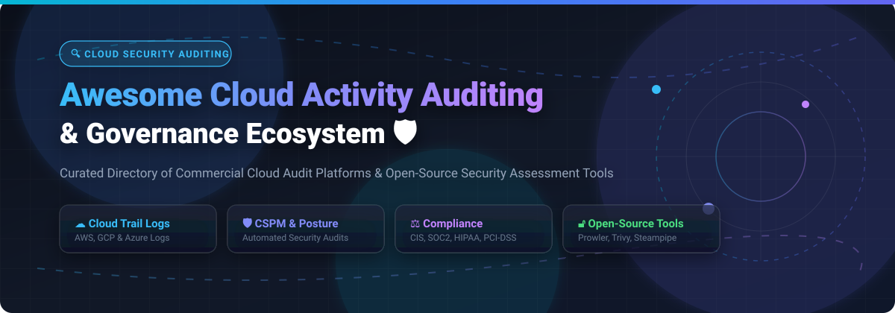

# Awesome-Cloud-Activity-Auditing-Governance

# Awesome-Cloud-Activity-Auditing-Governance 🔍 🛡️



  





  
  
  
  
  
  



---

## 🌟 Top Cloud Activity Auditing & Governance Ecosystem

**Curated List of Commercial Cloud Audit Platforms & Open-Source Security Assessment Tools**  
*Focused on Cloud Trail Analysis, Continuous Compliance Monitoring, Multi-Cloud Posture Management & Self-Hosted Security Auditing*

**Last updated: October 2026** 📅

---

### 📌 Overview & SEO Summary
Welcome to the ultimate curated directory of **cloud activity auditing platforms**, **open-source security posture management tools**, and **continuous compliance governance frameworks**. Whether you are looking for enterprise-grade commercial solutions (such as *AWS CloudTrail*, *Datadog Cloud SIEM*, and *Prisma Cloud*), or self-hostable open-source alternatives (like *Prowler*, *ScoutSuite*, and *Clouditor*), this list covers category leaders, multi-cloud assessment engines, and privacy-respecting audit pipelines.

---

## 📑 Table of Contents
- [🏢 SaaS & Commercial Platforms](#-saas--commercial-platforms)
- [🔓 Open-Source GitHub Projects](#-open-source-github-projects)
- [🛠️ How to Contribute](#%EF%B8%8F-how-to-contribute)
- [📊 Star History](#-star-history)
- [🤝 Support & Sponsorship](#-support--sponsorship)
- [⚠️ Disclaimer](#%EF%B8%8F-disclaimer)

---

## 🏢 SaaS / Commercial Platforms

The cloud activity auditing and governance market spans native provider tools (CloudTrail, Cloud Audit Logs, Azure Activity Log) that are often **free for basic logging but charge for extended retention**, and third-party platforms that aggregate multi-cloud audit data for unified governance. ISG Research ranks **Splunk, ServiceNow, and New Relic** as Product Experience Leaders in IT Observability, with Splunk scoring highest at 65.7% . **Datadog** leads in Cloud Monitoring Software mindshare at 3.9%, though user feedback consistently cites **cost control and performance degradation** as pain points . **Sumo Logic** received a B+ grade in the ISG Buyers Guide with a 56.5% performance score .

| SaaS / Commercial Platform | Company / Owner | Valuation / Market Cap | Standard Edition Starting Price | Free Tier / Free Trial Limits | Description |
| :--- | :--- | :--- | :--- | :--- | :--- |
| **[AWS CloudTrail](https://aws.amazon.com/cloudtrail/)** ☁️ | Amazon | ~$2.0 Trillion | **Free for 90 days of management event history**; $2.00 per 100,000 events beyond  | **90-day free event history** in console; no trail required | **AWS-native audit logging** — Records API activity across AWS services. **CloudTrail Lake** for extended retention and SQL-based querying. Default retention: 90 days. **Audit-trail logs must be archived separately** for long-term compliance . |
| **[Google Cloud Audit Logs](https://cloud.google.com/audit-logs)** 🌐 | Google (Alphabet) | ~$2.0 Trillion | **Free for 30-day default retention**; Cloud Logging charges apply for extended retention  | **30-day default retention**; 400-day exclusion for some log types  | **GCP-native audit logging** — Admin Activity, Data Access, System Event, and Policy Denied logs. **BigQuery** for analytics. Audit logs are not a 7-year archive path by default . |
| **[Azure Activity Log](https://azure.microsoft.com/en-us/products/monitor/)** 🔷 | Microsoft | ~$3.90 Trillion | **Free for 90 days**; $2.53/GB ingest for Log Analytics retention  | **90-day free retention** in Activity Log; no additional cost | **Azure-native audit logging** — Subscription-level events for resource changes. **Log Analytics** for extended retention with per-GB ingest charges . |
| **[Datadog Cloud SIEM](https://www.datadoghq.com/)** 🐶 | Datadog Inc. | ~$40 Billion | Custom per-GB ingest; Cloud SIEM priced separately | **14-day free trial**; no permanent free tier | **Cloud SIEM with log analytics** — Aggregates AWS CloudTrail, Azure Activity Log, and GCP Audit Logs. **User feedback: cost control and performance are top concerns**; administrators want more hard limits to prevent log spike expenses . |
| **[Splunk Cloud](https://www.splunk.com/)** 🟠 | Cisco (Splunk) | ~$200 Billion (Cisco) | **~$300K–$600K first year for 100 GB/day** | No free tier; trial available | **Enterprise SIEM and observability** — ISG Product Experience Leader with 65.7% performance score . **Cisco acquired Splunk March 2024 for $28B**. |
| **[Lacework](https://www.lacework.com/)** 🕸️ | Lacework (Fortinet) | Private | Custom workload-based pricing | **Free trial available** | **Cloud security and compliance** — Polygraph behavioral analytics for anomaly detection. Agent-based architecture. |
| **[Prisma Cloud](https://www.paloaltonetworks.com/prisma/cloud)** 🛡️ | Palo Alto Networks | ~$60 Billion | Custom enterprise pricing | **Free trial available** | **Cloud Native Application Protection (CNAPP)** — CSPM, CWPP, CIEM, and code security. Multi-cloud governance and compliance. |
| **[Panther Labs](https://panther.com/)** 🐾 | Panther Labs | Private | **Base ~$50K–$95K/year** + per-source $200–$1,200/source/year | No free tier; demo available | **Detections-as-code SIEM** — Python files in Git repos deployed via CI/CD. Best for engineering-led SOCs. **50 GB/day mid-market: $110K–$170K/year all-in**. |
| **[Rapid7 InsightIDR](https://www.rapid7.com/products/insightidr/)** 🟠 | Rapid7 Inc. | ~$3 Billion (Public) | **~$1.93 per asset per month** (500 assets) | **Free trial available**; no permanent free tier | **SIEM with user behavior analytics** — Cloud activity monitoring, UEBA, and incident response. Multi-year contracts with 3–7% annual escalation clauses. |
| **[Sumo Logic](https://www.sumologic.com/)** 📈 | Sumo Logic | Private | **Flex: $0 ingest**, pay per TB scanned ($3.14/TB estimated) | **Free trial: full access to self-service plans** | **Cloud SIEM with credit-based pricing** — B+ grade in ISG Buyers Guide with 56.5% performance score . No ingest charges in Flex model; pay for analytics. |

---

## 🔓 Open-Source GitHub Projects

*Sorted by GitHub_Stars_Count (Descending)* 🌟

- **[Prowler](https://github.com/prowler-cloud/prowler)**   
  **The most comprehensive open-source cloud security assessment tool**, Apache-2.0 licensed. **Open Source security tool for AWS, Azure, GCP, and Kubernetes** security best practices assessments, audits, incident response, continuous monitoring, hardening, and forensics readiness . **553 checks for AWS, 138 for Azure, 77 for GCP, 83 for Kubernetes** covering CIS, NIST 800, NIST CSF, PCI-DSS, GDPR, HIPAA, SOC2, and custom frameworks . **Prowler SaaS** service available on top of CLI. Outputs **OCSF v1.1.0 JSON** for standardized security analytics . Runs from workstation, Kubernetes Job, EC2, Fargate, CloudShell, or any container . 🛡️

- **[Matano](https://github.com/matanolabs/matano)**   
  **Open source security data lake for threat hunting, detection & response**, Apache-2.0 licensed. **1,475 stars** . **Serverless security lake for AWS** — ingests petabytes of security/log data, stores and queries in an **open Apache Iceberg data lake**, and creates **Python detections as code for realtime alerting** . **No vendor lock-in** — you always own your data. **Designed for zero-ops and unlimited elastic horizontal scaling** . VRL-based log normalization to ECS. **One of the highest-impact open-source cloud auditing projects** . 🏞️

- **[ScoutSuite](https://github.com/nccgroup/ScoutSuite)**   
  **Multi-cloud security auditing tool**, GPL-2.0 licensed. **Collects configuration data from cloud provider APIs and runs security checks** against it . Identifies misconfigurations like **publicly accessible S3 buckets, overly permissive IAM policies, unencrypted databases, and security groups with open ports** . **Version 5.12.0** (May 2026) added extensive rules for **CloudFront, EC2, ELB, IAM, S3, SQS, Azure AD, RBAC, GKE, CloudSQL, BigQuery, and Functions** . **NCC Scout** SaaS version offers persistent monitoring with expanded service coverage . 🔍

- **[Clouditor](https://github.com/clouditor/clouditor)**   
  **Continuous cloud assurance and compliance monitoring**, Apache-2.0 licensed. **Supports over 60 checks for AWS, Azure, and OpenStack** evaluated against **BSI C5 and CSA CCM** security requirements . **Cloud Compliance Language (CCL)** for descriptive custom rule development . **Automated service discovery** integrates with existing infrastructure. **Granular reporting** of detected non-compliant configurations. **v2 release in preparation** with improved APIs and storage . 🎯

- **[CloudFox](https://github.com/BishopFox/cloudfox)**   
  **AWS cloud penetration testing tool**, Apache-2.0 licensed. **Automating situational awareness for cloud penetration tests** . **`all-checks`** runs comprehensive assessment with reasonable defaults . Specialized commands: **`access-keys`** (active keys for cross-referencing), **`buckets`** (S3 inspection commands), **`cape`** (cross-account privilege escalation paths), **`cloudformation`** (stack enumeration with secrets discovery), **`databases`** (RDS connection strings), **`ecr`** (recent images for inspection), **`eks`** (cluster exposure and IAM roles), **`env-vars`** (secrets from App Runner, ECS, Lambda, Lightsail, SageMaker), **`iam-simulator`** (policy simulator evaluation), **`lambda`** (admin-role functions with download commands), **`network-ports`** (exposed services from security groups and NACLs), **`orgs`** (organization accounts), **`outbound-assumed-roles`** (outbound attack paths to other accounts) . 🦊

- **[Cloudsplaining](https://github.com/salesforce/cloudsplaining)**   
  **AWS IAM security assessment tool**, BSD-3-Clause licensed. **2,003 stars** . **Identifies violations of least privilege** and generates **risk-prioritized HTML reports** . **Finds actions with wildcards, data exfiltration risks, resource exposure risks, and privilege escalation** via IAM policies. **The standard tool for IAM policy auditing** in AWS environments. 🔐

- **[Cartography](https://github.com/lyft/cartography)**   
  **Infrastructure asset and relationship mapping**, Apache-2.0 licensed. **3,020 stars** . **Consolidates infrastructure assets and relationships in an intuitive graph view** powered by Neo4j . **Connects AWS, GCP, Azure, and SaaS sources** into a single queryable graph. **Enables advanced security queries** — "which S3 buckets are publicly accessible and what IAM roles can access them?" **The foundation for graph-based cloud security analysis**. 🗺️

- **[PacBot (Policy as Code Bot)](https://github.com/tmobile/pacbot)**   
  **Continuous compliance monitoring and security posture management**, Apache-2.0 licensed. **Automated governance** with policy-as-code. **Discovers misconfigurations, tracks compliance, and auto-fixes** issues. **Asset management and vulnerability assessment** integrated. **TMobile's open-source cloud governance platform**. 🤖

- **[Steampipe](https://github.com/turbot/steampipe)**   
  **Query cloud APIs with SQL**, AGPL-3.0 licensed. **~7k+ stars**. **Zero-ETL approach** — query AWS, Azure, GCP, Kubernetes, and 100+ services directly. **Build custom compliance queries with SQL**. The simplest way to explore cloud configuration data without data pipelines. 🔗

- **[CloudQuery](https://github.com/cloudquery/cloudquery)**   
  **Cloud asset inventory and CSPM**, MPL-2.0 licensed. **~5k+ stars**. **Extracts cloud configuration into PostgreSQL** for querying and analysis. **Enables custom governance queries** across multi-cloud environments. The foundation for building custom compliance dashboards. 📦

- **[ElectricEye](https://github.com/Cloud-Red-Team/ElectricEye)**   
  **Multi-cloud security posture management**, Apache-2.0 licensed. **962 stars** . **Python CLI tool for Asset Management, Security Posture Management & Attack Surface Monitoring** across AWS, Azure, GCP, and SaaS . **Continuous monitoring** with automated remediation. 🔭

- **[Substation](https://github.com/brexhq/substation)**   
  **Security event and audit log routing/normalization toolkit**, Apache-2.0 licensed. **332 stars** . **Routing, normalizing, and enriching security event and audit logs** at scale. **Designed for security data pipelines** feeding into data lakes and SIEMs. 🚰

- **[Prowler Dashboard](https://github.com/prowler-cloud/prowler)**   
  **Visual interface for Prowler assessments**, Apache-2.0 licensed. **Run `prowler dashboard`** after assessment to visualize findings . **Compliance framework mapping** with pass/fail/manual status. **Multi-provider results** in unified view. 📊

---

## 🛠️ How to Contribute

Contributions are welcome! Follow these steps to submit new cloud activity auditing platforms or open-source governance software:

1. 🍴 **Fork** the repository.
2. 📝 **Add/edit** entries in `README.md` maintaining table/list structure and formatting.
3. 🔗 Include project title, official website/GitHub link, exact Stars_Count, license, and brief description.
4. 🚀 Submit a **Pull Request** with a descriptive summary of your changes.

---

## 📊 Star History



---

## 🤝 Support & Sponsorship

If you find this cloud activity auditing repository useful, please consider supporting the project:

- ⭐ **Star** this repository to increase visibility!
- 🔀 **Fork** and share with fellow security engineers, compliance officers, and open-source advocates.
- ☕ **Sponsor & Buy Me a Coffee**: Support ongoing open-source curation via the [GitHub Sponsor Dashboard](https://github.com/sponsors/ishandutta2007).

---

## ⚠️ Disclaimer

- This is a **community-curated** list — not exhaustive and not an endorsement. ℹ️
- **Audit-trail logs have limited default retention**: AWS CloudTrail **90 days**, GCP Cloud Audit Logs **30 days**, Azure Activity Log **90 days** . **These are not 7-year compliance archives** — they must be exported to object storage or a SIEM with the same discipline as application logs .
- **Ingest cost, not storage, dominates long-term retention bills**: CloudWatch at **$0.63/GB** and Azure Monitor at **$2.53/GB** account for most of the managed-path cost before a single byte is archived . Bypassing the managed log tier for direct ingest changes 7-year totals by **a factor of 3 to 58** depending on provider .
- **Datadog cost control concerns**: Users consistently report needing **more hard limits** to prevent log spike expenses, and note **significant performance slowdowns** over the past year .
- Open-source solutions (Prowler, Matano, ScoutSuite, Clouditor) provide self-hosted ownership and transparency, but enterprise-grade SLA guarantees, managed infrastructure, and 24/7 support remain primarily commercial offerings. **Always validate findings against your specific compliance requirements** before acting. 🔍

---



  <b>Made with ❤️ for security engineers, compliance officers, and open-source cloud governance advocates.</b>

